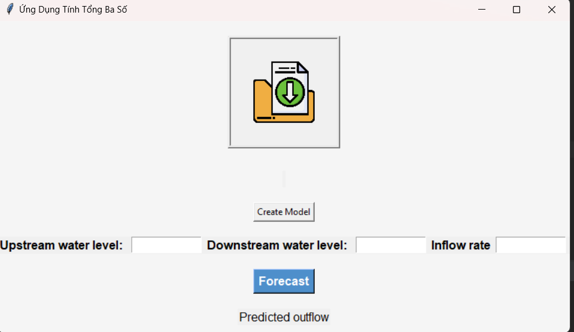

python version 3.10.0
library
 - tkinter
 - tkinterdnd2
 - pickle
 - pandas
 - sklearn
    
install:

 install library: pip install {name_library}
                  py -m pip install {name_library}

run program: 

 run main.py

 

 - import file dataset with 4 column: 'Upstream water level','Downstream water level','Inflow rate','outflow_rate'
   (If there is no data set, the system will use the available data)
 - create model before forecast
   
 - input 3 value: 'Upstream water level','Downstream water level','Inflow rate'
 - click button: 'Forecast'
  

Note Decal Data

- upstream_water_level : depth of water upstream in metres
- downstream_water_level : depth of water downstream in metres
- inflow_rate : reservoir water inflow rate in cubic metres per second
- outflow_rate : reservoir water outflow rate in cubic meters per second
